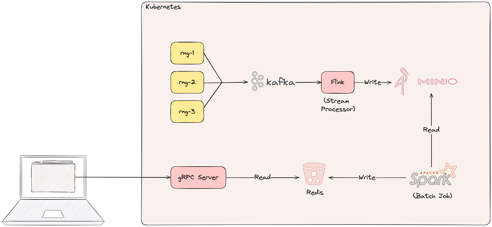

# Counter

This application counts the amount of even numbers that are generated in 1-minute intervals 



### Project Goals

The goal of this project is to demonstrate how to build an application that leverages online, nearline, and offline
elements using the following technologies:
1. [Kubernetes](https://kubernetes.io/)
2. [Protobuf](https://protobuf.dev/)
3. [Kafka](https://kafka.apache.org/)
4. [Beam](https://beam.apache.org/)
5. [Spark](https://spark.apache.org/)
6. [Minio](https://min.io/)
7. [Redis](https://redis.io/)
8. [gRPC](https://grpc.io/)
9. [Docker](https://www.docker.com/)

The application itself isn't very meaningful, but the architecture and the technologies used are. Further, this application
is structured as a monorepo and aims to keep the build, deployment, and testing process as easy and simple as possible.

## Prerequisites

You will need to have a few tools available to run this project:

1. A k8s cluster to deploy to (e.g. [minikube](https://minikube.sigs.k8s.io/docs/start/))
2. [kubectl](https://kubernetes.io/docs/tasks/tools/install-kubectl/)
3. [helm](https://helm.sh/)
4. [tilt](https://tilt.dev/) 

## Quickstart

### Deploy locally using Tilt

Deploy using Tilt:

```sh
tilt up
```

Stop using Tilt:

```sh
tilt down
```
